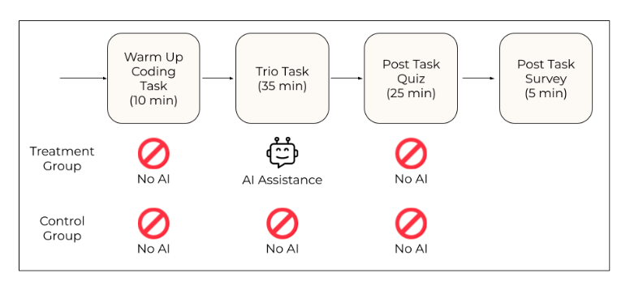
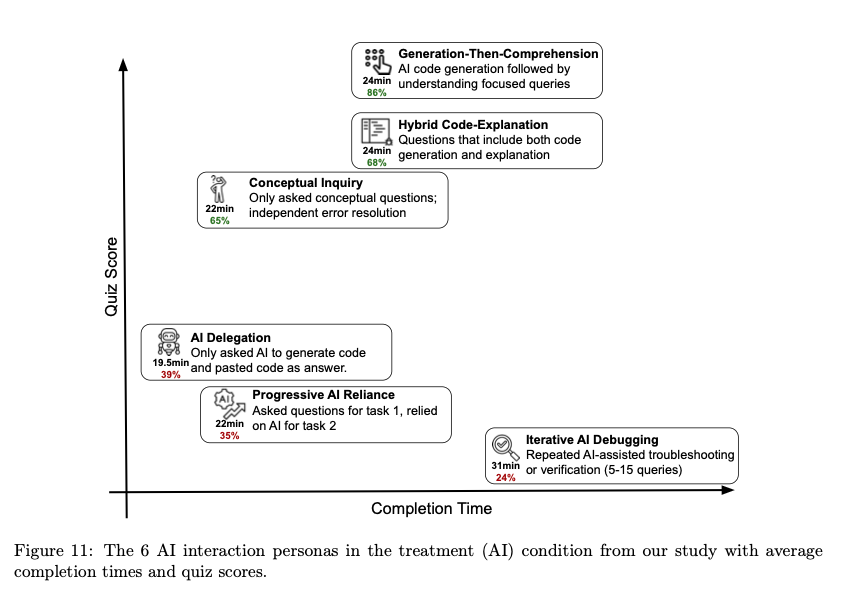

I'm always thinking about how knowledge workers can become high value while using AI. 

[Learning by doing](https://en.wikipedia.org/wiki/Learning-by-doing) is effective if you are getting stuck at problems/obstacles and clearing them yourselves - learning from it. With AI, the doing is happening but what about the learning?

Below are my notes from a research paper by Anthropic on [How AI impacts skill formation](https://arxiv.org/abs/2601.20245), which gives useful insights on the outcomes of different usage patterns of AI.

## Introduction

The paper answers these questions: 
1. Does AI assistance improve task completion productivity when new skills are required?
2. How does using AI assistance affect the development of these new skills?

## Procedure

  <em>Figure 4: Experiment procedure. Source: <a href="https://arxiv.org/abs/2601.20245">How AI Impacts Skill Formation</a></em>

They conducted randomized experiments that measure skill formation by asking participants to complete coding tasks with a new python library - [Trio](https://github.com/python-trio/trio)

<Callout type="note" title="About the Participants">
  1. More than 1 year of Python experience
  2. Code in Python at least once a week
  3. Tried AI coding assistance at least a few times
  4. Never used the Trio library before were recruited for this study.
</Callout>

It is assumed that 4 types of questions can help to assess mastery of coding skills:

- **Debugging** - Crucial for detecting when AI-generated code is incorrect and understanding why it fails.
- **Code Reading** - Enables humans to understand and verify AI-written code before deployment.
- **Code Writing** - Will be less important with further integration of AI coding tools than high-level system design. This was excluded from the experiment as this can be easily corrected through AI queries or web searches.
- **Conceptual** - Conceptual understanding is critical to assess whether AI-generated code uses appropriate design patterns that adheres to how the library should be used.

## Results

Below are the findings - answers to the research questions we began this blog with:

> Does AI assistance improve task completion productivity when new skills are required?

**Answer** - The productivity/acceleration in completion time with AI assitance was **statistically negligent**. But, through an in-depth qualitative analysis of screen recordings of every participant, this is explained through the **additional time some participants invested in interacting with the AI assistant**.

> How does using AI assistance affect the development of these new skills?

**Answer** - Using AI assistance to complete tasks that involve this new library resulted in a **reduction in the evaluation score by 17% or two grade points**.

## Notes on Qualitative Analysis

Above answers are derived from the statistical results of the study, but there were some interesting learnings from the qualitative analysis - mainly from manually annotating the screen recordings.

  <em>Figure 11: The 6 AI intersection personas. Source: <a href="https://arxiv.org/abs/2601.20245">How AI Impacts Skill Formation</a></em>

The **way of using AI showed a stark difference in test results**. This can be classified as:
- Low-scoring interaction patterns (24-39% scores)
- High-scoring interaction patterns (65-86% scores) 

### Low-Scoring Interaction Patterns

Focus is on just getting the work done.

#### 1. AI Delegation

<Callout type='summary' title='Info'>
- Participants wholly relied on AI to write code and complete the task.
- Fastest completion.
- Average - 39% score + 19.5 mins
</Callout>

Although the completion time was the lowest among all - which is understandable, this particular interaction pattern is very dangerous. It gets the work done, and we are left with no learnings, but a fake sense of progress, and a ton loads of appreciation from others (especially in workplaces).

#### 2. Progressive AI Reliance

<Callout type='summary' title='Info'>
- Participants started by asking 1 or 2 questions and eventually delegated all code writing to the AI Assistant. The questions were for task 1, but till they reached task 2 - everything was fully delegated.
- They scored relatively lower than the AI delegation people.
- Average - 35% score + 22 mins
</Callout>

The score is counterintuitive, I am not sure why?*
But, eventually ai delegation happened in task 2, which is a red light.

#### 3. Iterative AI Debugging

<Callout type='summary' title='Info'>
- Participants in this group relied on AI to debug or verify their code.
- Relied on the assistant to solve problems, rather than asking follow-up questions
- Poor quiz scores and were relatively slower
- Average - 24% score + 31mins
</Callout>

I think of this as a lock-in on an approach to solve a problem - which ofcourse the AI decides, since its doing all the thinking here. This is risky as there are chances that the approach is wrong - because of less context on the problem, or low quality prompting. Doing iterative debugging may clear you of the errors, but never takes a step-back on the approach which inturn gives you more errors down the road.

### High-Scoring Interaction Patterns

Here the focus is not just work completion, but conceptual understanding too.

#### 1. Generation-Then-Comprehension

<Callout type='summary' title='Info'>
- Participants first generated code and then manually copied or pasted code into their work.
- After code generation, they asked follow-up questions to improve understanding.
- Average - 86% score + 24 mins
</Callout>

People who are delegating everything to AI, should start asking follow-up questions after code generation or work completion as this is just 1 more query and gradually will let them jump to the High-Scoring interaction pattern.

#### 2. Hybrid Code-Explanation 

<Callout type='summary' title='Info'>
- Participants asked for code generations with their explanations.
- Took comparitively more time.
- Average - 68% score + 24 mins
</Callout>

I think this approach is strong as it helps to maneuver the AI if its wrongly thinking the problem/solution. Helps complete work, and also form a good understanding of the task with relatively less tokens.

#### 3. Conceptual Inquiry

<Callout type='summary' title='Info'>
- Participant only asked conceptual questions and relied on their understanding to complete the task.
- Encountered many errors, but resolved them independently.
- Fastest among this pattern.
- Average - 65% score + 22 mins
</Callout>

I love this approach of using AI only for understanding the concepts and brainstorming. I feel this approach helps a lot when we learn new skills as encountering errors are important, and this way you are using the capabilities of AI without taking away the struggle and frustration that comes with learning something new. 

---

## Thoughts

This is a good study done by Anthropic, and I appreciate them for putting this out even though they are an AI company, and are also pushing claude code so much!

I figure there are high chances AI can turn out disastrous for skill development in students and novice programmers if not used carefully. 

<Callout type='bug' title='Why the Inclination?'>
Majority of novice programmers are inclining themselves to using AI and delegating their thinking on solving problems, and I think it's because of the following factors (this can easily be an endless list - but I am listing out the ones I have seen frequently):
1. Failing to endure the struggles and frustrations when learning something new and resorting to AI, hence falling into the trap of false progress.
2. Strict deadlines in workplaces.
3. FOMO - Everybody is using it and finishing tasks early, why shouldn't I?
</Callout>

Since the current frontier models are very good at agentic coding - they can complete tasks in no time, and they can end up giving you a fake sense of progress in skill formation if you don't know whats going on conceptually. The abilities of AI are only going up with new models, or atleast that's what the model providers are aiming at. That means getting stuck, or getting forced to solve problems which are required for skill formation, are highly improbable. 

After reading the paper, I am planning to be hell bent on approaching new skills with the first principles - `fall down, and stand up kind of learning approach`. Embrace problems, frequent situations of confusion and getting stuck.

I'd like to clear that **this is not a no to AI, but the usage pattern needs to be different and well thought out**. You can prompt and use it however you want. 

So, prompt it to be a **24/7 teacher and use it to fuel your curiosity!**

I feel the constant use of AI for "thinking" is a blind pursuit towards becoming the ["hive mind"](https://en.wikipedia.org/wiki/Group_mind_(science_fiction)) or ["pluribus"](https://en.wikipedia.org/wiki/Group_mind_(science_fiction))ification of oneself. No thanks, I prefer my individuality - let's be careful.

