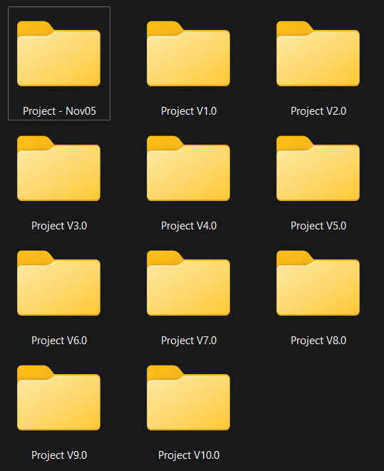
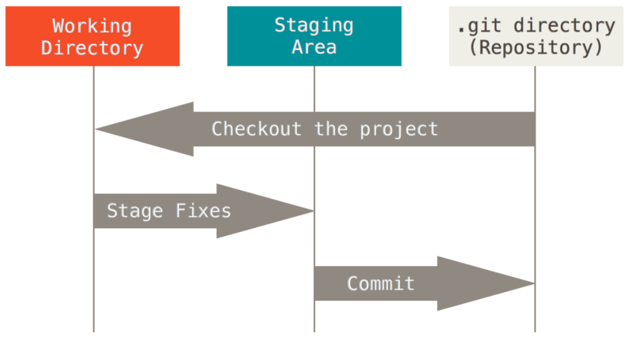
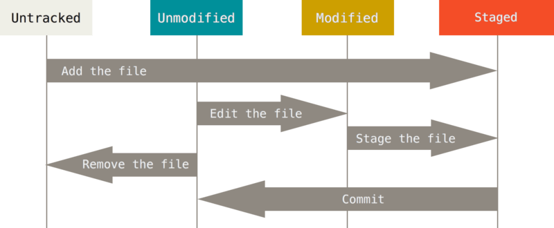
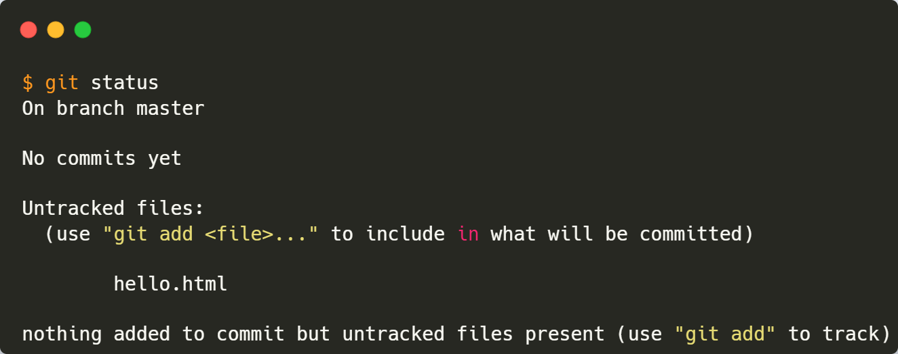
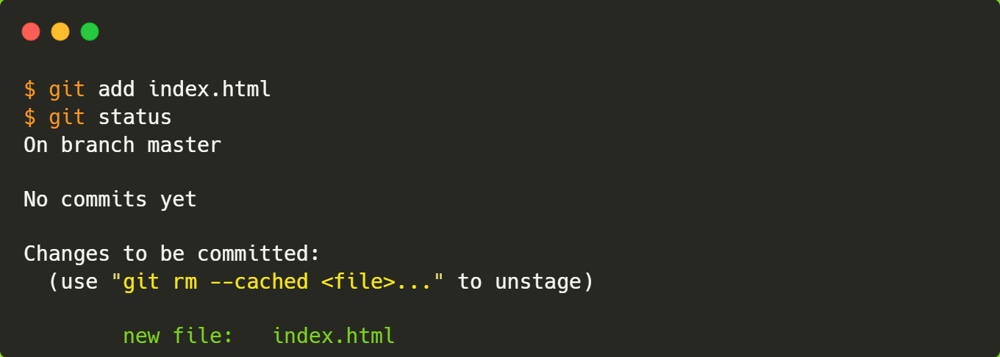
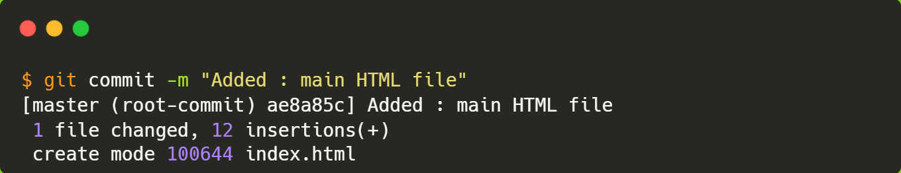
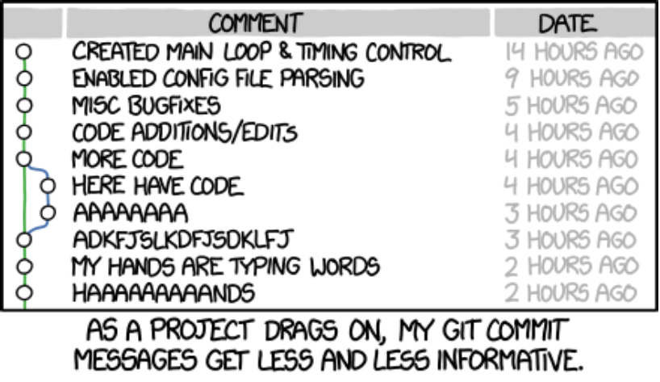
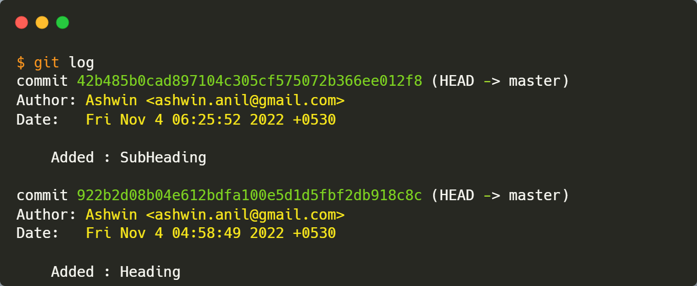
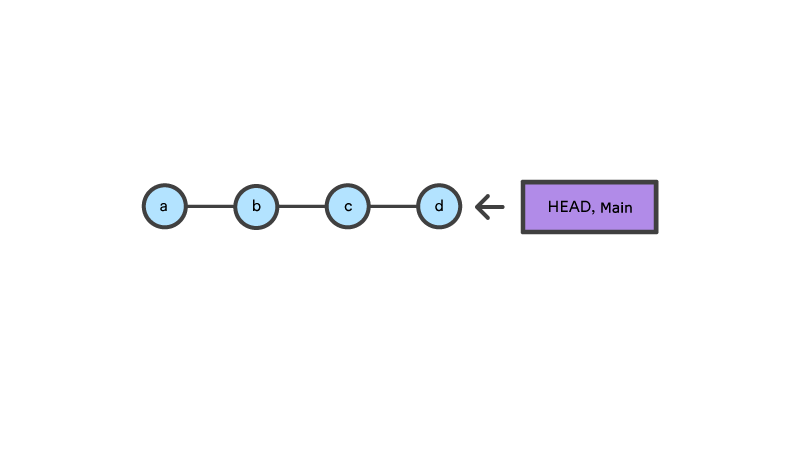
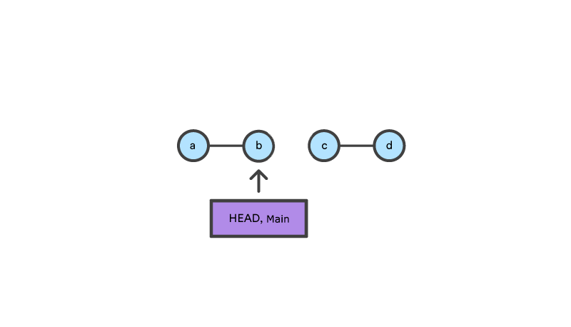

How to track changes in your codebase? <br> 
How to collaborate with others on a project? <br> How to manage different versions of your code?

Come, let's find out!

## What is Version Control ?

Version control is a system that records changes to a file or set of files over time so that you can recall specific versions later.

### Local Version Control

- Many people’s goto choice.
- The approach is to **copy files into another directory** (perhaps a time-stamped directory, if they’re clever).
- This approach is very common because it is so simple, but **it is easy to forget which directory you’re in and accidentally write to the wrong file or copy over files you don’t mean to.**



## What is Git?

- By far, the **widely used** modern version control system!
- Distributed Developement
    
    For a centralized VCS, each developer gets a working copy that points back to a single central repository. Git, however, is a distributed version control system.
    
    <aside>
    📌 Instead of a working copy, each developer gets their own local repository, complete with a full history of commits.
    
    </aside>
    
    Having a full local history makes Git fast, since it means you don’t need a network connection to create commits, inspect previous versions of a file.
    

## What is Github?

- Git is not the same as GitHub.
- GitHub is a cloud-based hosting service that lets you manage Git repositories.
- Helps share our code with others

Alright, lot of theory, lets code!

## Getting Started

1. [Download](https://git-scm.com/downloads) and Install
2. Open Git Bash

### Your Identity

The first thing you should do when you install Git is to set your user name and email address.

<aside>
📢 This is important because every Git commit uses this information

</aside>

```bash
git config --global user.name "Andrew Late"
git config --global user.email seeWhatIdidThere@haha.com
```

<aside>
📢  <code>--global</code> option - Git will always use that information for anything you do on that system. If you want to override this with a different name or email address for specific projects, you can run the command without the `--global` option when you’re in that project.

</aside>

### Checking Your Settings

```bash
git config --list
```

### Getting Help

```bash
# 1
git help <command>

# 2
git <command> --help

#Example
git help add
```

---

## The PAY ATTENTION moment begins here!

### The 3 States

Git has three main states that your files can reside in: modified, staged and committed:

- **Modified** means that you have changed the file but have not committed it to your database yet.
- **Staged** means that you have marked a modified file in its current version to go into your next commit snapshot.
- **Committed** means that the data is safely stored in your local database.

<aside>
This leads us to the three main sections of a Git project:

1. **The Working Directory** - One Version of the project that can be used or modified.
2. **Staging Area** - Stores information about what will go into your next commit.
3. **.git directory(Repository)**- Contains all the commits.
</aside>



<aside>
<strong>Basic Workflowgi</strong>

1. You modify files in your working tree.
2. You selectively stage just those changes you want to be part of your next commit, which adds ***only*** those changes to the staging area.
3. You do a commit, which takes the files as they are in the staging area and stores that snapshot permanently to your Git directory.
</aside>

### Status of Files

Each file in your working directory can be in one of two states: **Tracked** or **Untracked.**

- Tracked files consists of **Unmodified**, **Modified** and **Staged** files.
- Untracked files are **everything else.**

When you perform `git init` all files present in the working directly are **Untracked.**



### Checking the Status of Files

The main tool you use to determine which files are in which state.

```bash
git status
```

To do: 

1. Add a new file
2. Now run the git status command



You can see that your new `index.html` file is untracked because it’s under the “Untracked files” heading in your status output. An untracked file basically means that Git doesn't know about it and will only track the file if you explicitly tell it to do so.

### Tracking New Files

Let’s start tracking the new file that we added.

```bash
git add <file_name>

# To add Everything, literally
git add -A

# To make it interactive
git add -p
```

To begin tracking the `index.html` file, <br> you can run the `git add index.html` command. Now, if you run the status command again: 



You can see that your `index.html` file is now **tracked and staged to be committed.**

<aside>
<strong>You want to know exactly what you changed?</strong> <br>
Use the `git diff` command.
</aside>

### Committing Changes

Now that your staging area is set up the way you want it, you can commit your changes. 

<aside>
<strong>Remember</strong>

- Any files you have **created** or **modified** that you haven’t run `git add`
 on since you edited them — won’t go into this commit. They will stay as modified on your disk.

- Every time you perform a commit, you’re recording a **snapshot** of your project that you can revert to or compare to later.
</aside>

To commit the changes, the following command is used:

```bash
git commit <filename> -m "<Message>"

# Committing the whole staging area
git commit -m "<Message>"
```

In our case, run `git commit -m “Added: HTML file”`



**Observations**

Now you’ve created your first commit! You can see that the commit has given you some output about itself: 

- Which branch you committed to ⇒ `master`
- What SHA-1 checksum the commit has ⇒ `ae8a85c`
- How many files were changed, and statistics about lines added and removed in the commit.

Let’s create a couple of commits.



### Viewing the Commit History

After you have created several commits, you’ll probably want to look back to see what has happened. The following command helps you do it:

```bash
git log

# Also prints the list of modified files, and their details
git log --stat

# Limit to "n" entries
git log -n

# Printing each commit on a single line
git log --oneline
```

Let’s run `git log` on our machine.



**Observations**

- By default, `git log` lists the commits made in that repository in reverse chronological order (i.e., the most recent commits show up first.)
- The command lists each commit with its
    1. SHA-1 checksum, 
    2. Author’s name and email, 
    3. Date, and 
    4. Commit message.

<aside>
<strong>The hell is HEAD?</strong>

 HEAD tells you:

- What branch you're currently one,
- What the next parent will be (cuz HEAD is now the pointing to the parent of the next commit).
</aside>

### Removing Commits / Going back

The following command is used to go back:

```bash
git reset <commit_hash>

# Reset to previous commit
git reset --hard HEAD^
```

Let's Understand



After doing `git reset b` , now the HEAD and Main are pointing to the commit “b”.



### Undoing Things

At any stage, you may want to undo something. Here, we’ll review a few basic tools for undoing changes that you’ve made.

<aside>
<strong>Be careful, because you can’t always undo some of these undos.</strong> 
This is one of the few areas in Git where you may lose some work if you do it wrong.
</aside>

- **Case 1: When you commit too early and possibly forget to add some files, or you mess up your commit message.**
    
    If you want to redo that commit, make the additional changes you forgot, stage them, and commit again using the `--amend` option.
    
    ```bash
    git commit --amend -m "<Message>"
    ```
    
    This command takes your staging area and uses it for the commit. 
    
    <aside>
    <strong>If you’ve made no changes since your last commit</strong> (for instance, you run this command immediately after your previous commit), then
    
    your snapshot will look exactly the same, and all you’ll change is your commit message.
    </aside>
    
- **Case 2: To unstage a staged file**
    
    The nice part is that the `git status` reminds you how to undo changes to them.
    
    ```bash
    git restore --staged <file>
    ```
    
- **Case 3: Unmodifying a modified file**
    
    What if you realize that you don’t want to keep your changes to a file that you just modified? 
    
    Luckily, `git status` tells you how to do that too.
    
    ```bash
    git restore <file>
    ```

## Conclusion

If you’ve made it this far, you already are acquainted with the basics of Git. 

Its totally alright if you don’t remember the commands, just make sure you understand what is happening at each stage and you’ll be good to go. 

<aside>
<strong>References</strong>

- [Git Book](https://git-scm.com/book/en/v2)
- [Getting Git right](https://www.atlassian.com/git)
</aside>

That’s it for this post.

Thanks for reading!