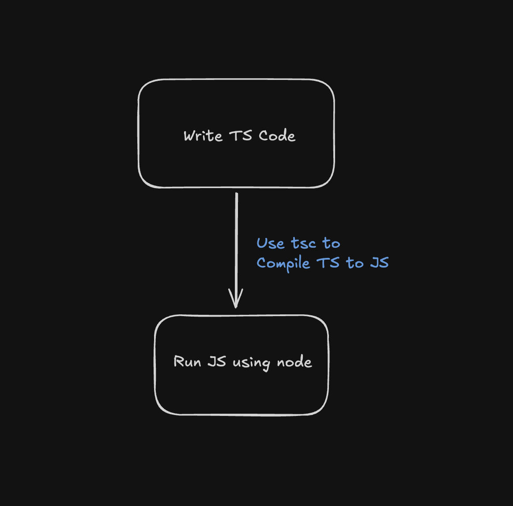

Node.js doesn't support TypeScript out of the box. 

That doesn't mean you can't run TypeScript with Node. Just, that you need to do a little extra work.



Let's do that here!

Start with a new directory and `cd` into it.

```bash
mkdir my-ts-project
cd my-ts-project
```

## Step 1 - Starting with a Node.js Project

Initialize a new Node.js project.

```bash
npm init -y
```

<aside>

To run TypeScript, we need something that can **convert TypeScript code to JavaScript**, so that Node.js can run it.

That something is `tsc` - TypeScript Compiler.
</aside>

## Step 2 - Installing TypeScript

To use `tsc`, we need to install TypeScript.

```bash
npm install typescript
```

This installs TypeScript locally in your project.

As we have **installed TypeScript locally**, we cannot use the `tsc` command directly from the bash as it doesn't exist in the global context.

So, we can use `npx` (or `pnpm dlx` - for pnpm)

```bash
# Run this to initializes a TypeScript project
npx tsc --init
```

This creates a `tsconfig.json` file in your project. This file is used to configure TypeScript compiler.

<aside>

<strong>How can I run tsc directly?</strong>

```bash
# This installs typescript globally
npm install -g typescript
```

Now use `tsc`
</aside>

## Step 3 - Writing TypeScript Code

Create a new file `index.ts`

```typescript
// index.ts
console.log('Hello TypeScript');
```

## Step 4 - Running TS

To run this code, 2 steps are needed:
1. Compile `ts` into `js` - using `tsc`
2. Run `js` using nodejs

```bash
# This compiles all ts files in your project into js
npx tsc  

# OR

# This compiles all CHANGED ts files in your project into js (takes relatively less time)
# Avoids unnecessary recompilation of unchanged files.
npx tsc -b
```

The above command(whichever you choose to run) will create a new file `index.js` in the same directory.

Now, run the `index.js` file using Node.js

```bash
node index.js
```

And that's it, you just ran TypeScript using Node.js
