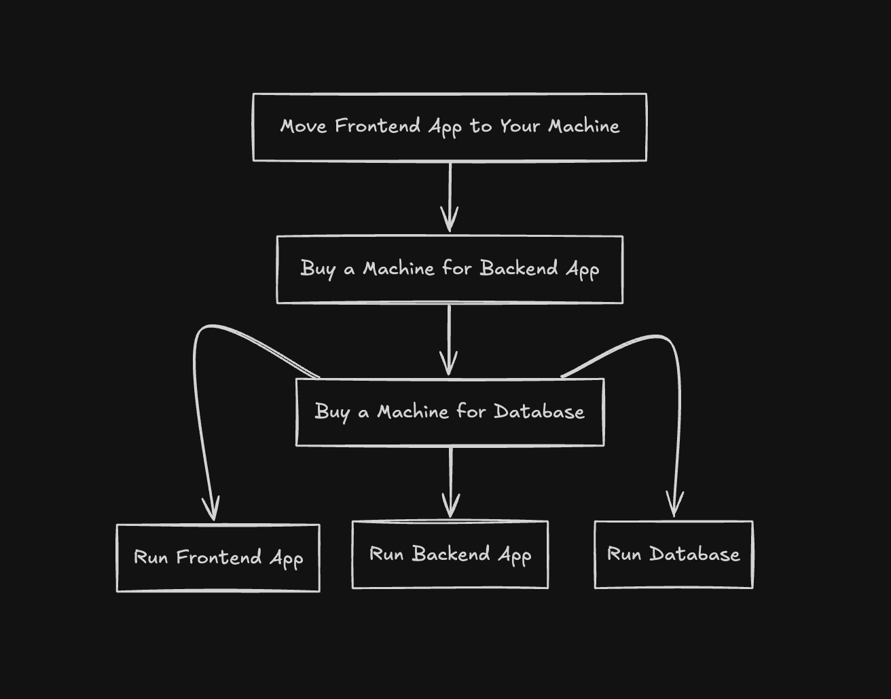
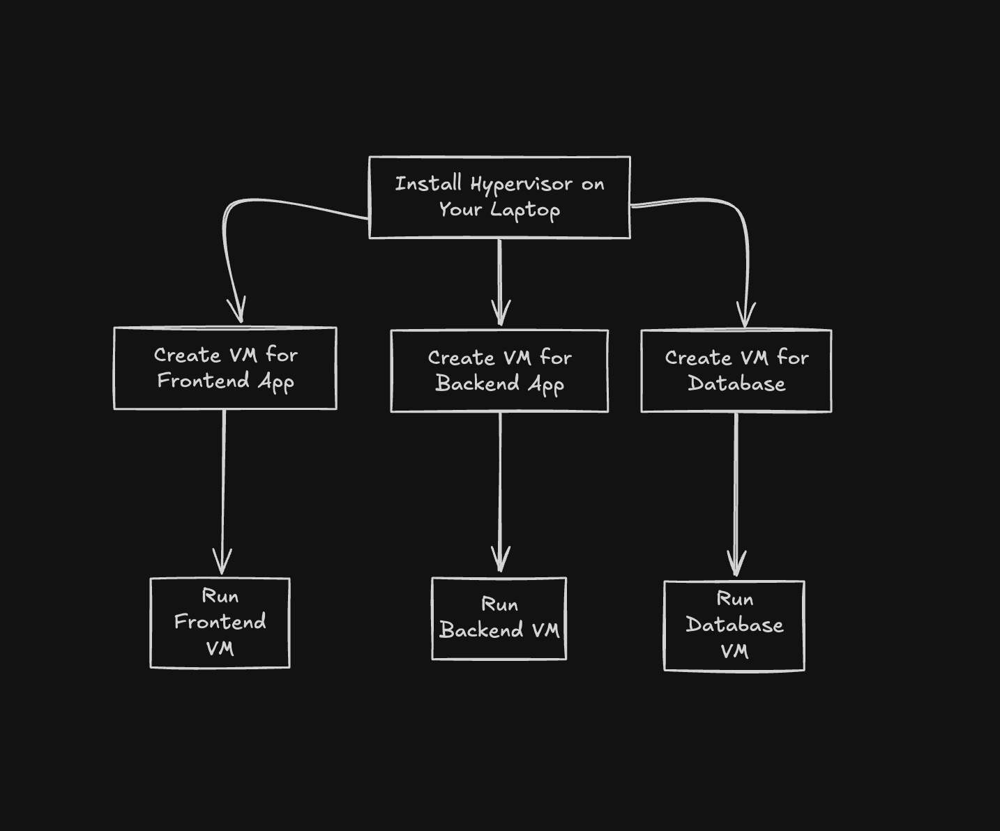
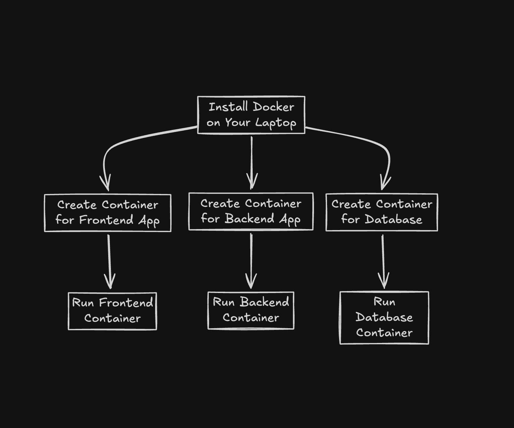

Here, I'll take you through a conceptual journey from running an app on a physical machine to running it in a container.

<aside>
<strong>What does deploy mean?</strong>

In short - `Process of making an application available for use.`

It ensures that the app runs efficiently on a server or device and is accessible to the customer or end-user.
</aside>

Lets see how to deploy an app. 

Deploying essentially means running an app. So, I'll just talk about running an app in the below content.

Things you have:
1. Money Manager App
  - Frontend App written in **React**
  - Backend App written in **Node.js**
  - Database - **postgreSQL**
2. A physical machine (let's say your laptop)

lets start!

## 1. Bare Metal Servers

`No Abstractions`

In the early days, every app ran on its own dedicated physical machine.

<aside>
<strong>Using bare metal for running our apps</strong>

So, according to the above scenario, you would run the frontend app, backend app, and database on 3 different machines.

Now, you would say - why not just run everything on the laptop.

But, you wouln't want your backend or frontend app to interfere with the database right?

So, let's buy 2 more machines.

Now the apps run in isolation from each other.
</aside>

### Problems

- space
- cost
- maintenance
- wastage of resources
 
  The machine would be running 24/7, but the app would not be using the machine's full capacity all the time.
- scalability 
  
  If the app needed to scale, you would have to scale the machine horizontally (buying more machines) or vertically(upgrading the existing machine) - adding more cost.

You can see that running an app on a physical machine is not efficient.

This is where **virtualization** comes in.

## 2. Virtualization

`Abstraction between you and the hardware`

This concept lets us run multiple digital machines (called Virtual Machines - VMs) on a single physical machine.

Virtualizes the underlying hardware - VMs have their own OS, and share the same hardware.

Who lets you do that? [Hypervisor](https://aws.amazon.com/what-is/hypervisor/)

The hypervisor is a software that creates and runs virtual machines. It manages the virtual machines' resources and isolates them from each other.

<aside>
<strong>Using VMs for running our apps</strong>

Each app runs on a separate VM. So, running of the apps looks like the below image.

Now, the apps run on the same physical machine, also being isolated from each other.
</aside>

### Problems

Each VM has its own OS, which means:
- heavyweight
- consume more resources
- slower compared to running on a physical machine

I mean you just want to run an app! Why do you need a full OS for that?
Is there a way to run an app without the overhead of a full OS?
Is there a way to run an app in an environment that has everything it needs to run?

This is where **containerization** come in.

## 3. Containerization

`Abstraction between you and the OS`

Containers packages an application in such a way that it can run the same way across multiple environments.

It virtualizes the OS - containers share the same OS kernel.

Who lets you do that? [Container Engine](https://www.wiz.io/academy/container-engine)

The container engine (like [Docker](https://www.docker.com/)) is a software that creates and runs containers. It manages the containers' resources and isolates them from each other.

<aside>
<strong>Using Containers for running our apps</strong>

Here, instead of recreating an environment for the app to run (which we used to do in the case of VMs), 

we just make the application capable of running on all types of environments.

Now, the apps are isolated from each other and can run on the same physical machine, and they share the same OS kernel.
</aside>

### Advantages

- lightweight and portable
- fast to start
- consume fewer resources
- easy to scale, doesn't waste resources
- easy to develop apps in, apt for teams working in different environments
- more apps can run on the same hardware, than VMs
- easy for developers to work on the app

You can run more containers than VMs on a given physical machines, so technically more apps can run on the same hardware.

That's it for now.

I hope we are clear on the journey from running an app on a physical machine to running it in a container.